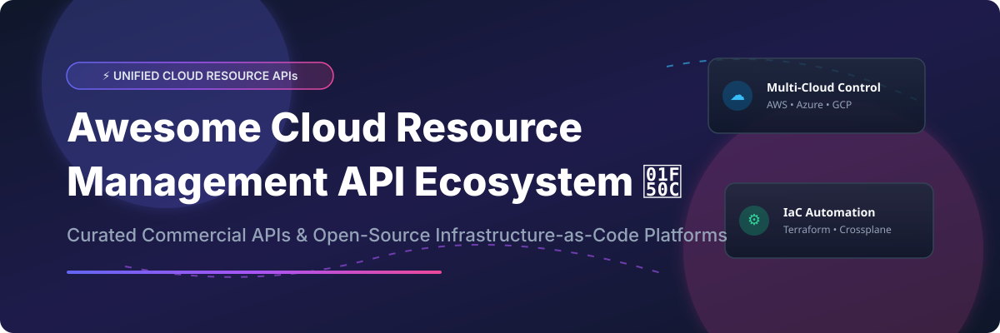

# Awesome-Cloud-Resource-Management-API

# Awesome-Cloud-Resource-Management-API 🔌 ☁️



  





  
  
  
  
  
  



---

## 🌟 Top Cloud Resource Management API Ecosystem

**Curated List of Commercial Resource Management APIs & Open-Source Infrastructure-as-Code Platforms**  
*Focused on Unified Resource Provisioning, Declarative Infrastructure, Multi-Cloud Control Planes, Policy as Code & Self-Hosted IaC Automation*

**Last updated: October 2026** 📅

---

### 📌 Overview & SEO Summary
Welcome to the ultimate curated directory of **cloud resource management APIs**, **open-source Infrastructure-as-Code platforms**, and **multi-cloud control plane frameworks**. Whether you are looking for enterprise-grade commercial solutions (such as *AWS Cloud Control API*, *Terraform Cloud*, and *Pulumi*), or self-hostable open-source alternatives (like *Crossplane*, *OpenTofu*, and *Terrakube*), this list covers category leaders, unified resource provisioning, and privacy-respecting infrastructure automation.

**Key Market Context:**
- **AWS Cloud Control API** provides a **standardized REST API** for create, read, update, delete, and list operations across AWS services with **immediate consistency**.
- **Crossplane** is a **CNCF graduated project** that turns Kubernetes into a universal control plane for cloud infrastructure with **continuous reconciliation** — automatically correcting drift.
- **OpenTofu** emerged as the **Linux Foundation-backed fork** of Terraform after HashiCorp's BUSL license change, with **state encryption** and **provider caching** improvements.

---

## 📑 Table of Contents
- [🏢 SaaS & Commercial Platforms](#-saas--commercial-platforms)
- [🔓 Open-Source GitHub Projects](#-open-source-github-projects)
- [🛠️ How to Contribute](#%EF%B8%8F-how-to-contribute)
- [📊 Star History](#-star-history)
- [🤝 Support & Sponsorship](#-support--sponsorship)
- [⚠️ Disclaimer](#%EF%B8%8F-disclaimer)

---

## 🏢 SaaS / Commercial Platforms

The cloud resource management API market spans **hyperscaler native APIs** (AWS Cloud Control API, Azure Resource Manager, Google Cloud Resource Manager) that provide **unified provisioning across their respective services**, and **specialized IaC platforms** (Terraform Cloud, Pulumi, Spacelift) that offer **multi-cloud orchestration, policy enforcement, and state management**. **AWS Cloud Control API** is **free** — you pay only for the underlying resources provisioned . **Terraform Cloud** charges **$0.00014/resource/hour** on Plus tier with **500 free resources** . **Pulumi** offers a **free individual tier** and **Team at $30/user/month** . **Spacelift** and **env0** use **consumption-based pricing** per environment or per successful apply .

| SaaS / Commercial Platform | Company / Owner | Valuation / Market Cap | Standard Edition Starting Price | Free Tier / Free Trial Limits | Description |
| :--- | :--- | :--- | :--- | :--- | :--- |
| **[AWS Cloud Control API](https://aws.amazon.com/cloudcontrolapi/)** ☁️ | Amazon | ~$2.0 Trillion | **Free API**; pay only for underlying resources | **Free forever** | **AWS-native unified API** — **Standardized CRUD+L operations** across AWS services . **Immediate consistency** — changes reflected instantly. **Uniform JSON schema** across services. **CloudFormation registry** integration for resource types. |
| **[Google Cloud Resource Manager](https://cloud.google.com/resource-manager)** 🌐 | Google (Alphabet) | ~$2.0 Trillion | **Free API**; pay for underlying GCP resources | **Free forever** | **GCP-native resource hierarchy** — **Organizations, folders, and projects** with IAM. **Tags** (50 key-value pairs per resource, 1,000 keys per org), **quotas**, and **usage limits** . |
| **[Azure Resource Manager](https://azure.microsoft.com/en-us/products/azure-resource-manager/)** 🔷 | Microsoft | ~$3.90 Trillion | **Free control plane**; pay for underlying resources | **Free forever** | **Azure-native deployment and management** — **Declarative templates (ARM/Bicep)** for resource provisioning. **Resource groups** for lifecycle management. **RBAC and policy enforcement** . |
| **[HCP Terraform](https://www.hashicorp.com/products/terraform)** 🏗️ | HashiCorp (IBM) | ~$5 Billion (Acquisition) | **$0.00014/resource/hour** (Plus); **$0.00028** (Enterprise) | **Free tier: 500 resources** | **Managed Terraform platform** — **Remote state management**, VCS integration, **Sentinel policy as code**, and **private module registry**. **Sentinel is proprietary** — only available on HCP Terraform/Terraform Enterprise . |
| **[Pulumi Cloud](https://www.pulumi.com/)** 🚀 | Pulumi | Private | **Team: $30/user/month**; **Enterprise: custom** | **Free: Individual tier** | **Modern infrastructure as code** — **Write IaC in TypeScript, Python, Go, C#, or Java**. **Universal cloud support** (AWS, Azure, GCP, Kubernetes). **Pulumi Cloud** adds state management, secrets, and policy as code . |
| **[Spacelift](https://spacelift.io/)** 🎛️ | Spacelift | Private | **Custom per-environment pricing** | **Free trial available** | **Multi-IaC orchestration platform** — **Runs Terraform, OpenTofu, Terragrunt, Pulumi, CloudFormation, Kubernetes, and Ansible**. **Policy hooks at every lifecycle stage**, custom runner images, and **stack dependency chains** . |
| **[Scalr](https://scalr.io/)** ⚙️ | Scalr | Private | **Free: up to 50 runs/month**; **Enterprise: starting at 20,000 runs/year** | **Free: 50 runs/month** | **Terraform and OpenTofu automation platform** — **Drop-in replacement for Terraform Cloud** with feature parity . **OPA policy enforcement**, drift detection, and **keyless authentication via OIDC** . **No per-user fees, no per-resource charges** . |
| **[env0](https://www.env0.com/)** ⚡ | env0 | Private | **Custom per-apply or per-environment pricing** | **Free: 250 runs/month, up to 30 active environments** | **Multi-IaC with FinOps focus** — **Cost tracking, budget controls, and per-environment cost attribution**. Supports **Terraform, OpenTofu, Terragrunt, Pulumi, and CloudFormation** . |
| **[StackGuardian](https://www.stackguardian.io/)** 🛡️ | StackGuardian | Private | **Custom enterprise pricing** | **Free tier available** | **Policy-as-code platform** — **GitOps-based IaC orchestration** with **OPA/Rego policy enforcement**. **Multi-cloud support** with **self-hosted runners** . |
| **[Terrateam](https://terrateam.io/)** 🐙 | Terrateam | Private | **Custom pricing**; **free for open-source** | **Free for open-source projects** | **GitHub-native GitOps for Terraform** — **Runs Terraform, OpenTofu, CDKTF, and Terragrunt operations via pull requests**. **Open-source (MPL-2.0)** with commercial SaaS offering . |

---

## 🔓 Open-Source GitHub Projects

*Sorted by GitHub_Stars_Count (Descending)* 🌟

- **[Crossplane](https://github.com/crossplane/crossplane)**   
  **Kubernetes-based control plane for cloud infrastructure**, Apache-2.0 licensed. **CNCF graduated project** — turns cloud resources into **Kubernetes custom resources** with **continuous reconciliation** . **Automatically corrects drift** without manual `terraform apply` — the control plane continuously ensures desired state matches actual state . **Compositions** enable self-service infrastructure APIs for developers — platform teams define abstractions while developers provision through Kubernetes manifests. **Prerequisite**: a healthy Kubernetes cluster as critical infrastructure . **The most architecturally significant open-source resource management API** — brings cloud provisioning into the Kubernetes ecosystem . ☸️

- **[OpenTofu](https://github.com/opentofu/opentofu)**   
  **Open-source Terraform fork**, MPL-2.0 licensed. **Linux Foundation and CNCF Sandbox project** . **Drop-in replacement** for Terraform 1.5.6+ with **state encryption**, **provider caching improvements**, and **active community governance** . **Supported by Spacelift, env0, Scalr, and Terragrunt** . **The community-governed alternative** after HashiCorp's BUSL license change . 🍞

- **[Terragrunt](https://github.com/gruntwork-io/terragrunt)**   
  **Thin wrapper for Terraform/OpenTofu**, MIT licensed. **Keeps configurations DRY** across environments with inheritance, **automatic remote state management**, **dependency ordering**, and **stack-wide deployment commands** . **Version 1.0 (April 2026)** introduced formal **unit/stack terminology** and **unified `--filter` system** . 📦

- **[Terramate](https://github.com/terramate-io/terramate)**   
  **Orchestrator and code generator for Terraform/OpenTofu**, MPL-2.0 licensed. **Introduces stack concepts, global variables, and code generation** to simplify environment management . **Built-in change detection** for faster CI/CD. **Bundles** provide reusable contracts between platform teams and application teams . 🗂️

- **[Atlantis](https://github.com/runatlantis/atlantis)**   
  **Terraform PR automation**, Apache-2.0 licensed. **Listens for pull request comments** (`atlantis plan`, `atlantis apply`) and runs Terraform in response . **The simplest way to get plan/apply output in PRs** . **No native policy enforcement, RBAC, audit trail, or drift detection** — requires external tooling . 🏛️

- **[Terratest](https://github.com/gruntwork-io/terratest)**   
  **Go library for infrastructure testing**, Apache-2.0 licensed. **Write automated tests for Terraform, Packer, Kubernetes, and more** using Go's testing framework . **Stands up real infrastructure, validates behavior, and tears down** . **Complements `terraform test`** for integration coverage . 🧪

- **[Checkov](https://github.com/bridgecrewio/checkov)**   
  **Static analysis for IaC**, Apache-2.0 licensed. **Scans Terraform, CloudFormation, Kubernetes, and more** for security and compliance misconfigurations . **Plan-aware scanning** evaluates resolved values from `terraform plan` . **Rich policy library** and **SARIF output** for GitHub code scanning . 🔍

- **[tfsec](https://github.com/aquasecurity/tfsec)**   
  **Fast static security scanner for Terraform**, MIT licensed. **Optimized for speed in CI** — runs in seconds on code diffs . **Developer-friendly feedback** with **SARIF output** . **Best paired with Checkov** for plan-aware deeper analysis . ⚡

- **[Terratag](https://github.com/env0/terratag)**   
  **Automatic tagging for Terraform resources**, MPL-2.0 licensed. **CLI tool that applies tags or labels across entire Terraform/Terragrunt files** for AWS, GCP, and Azure resources . **Ensures consistent cost allocation and compliance tagging** . 🏷️

- **[Terrakube](https://github.com/terrakube-io/terrakube)**   
  **Open-source Terraform Cloud alternative**, Apache-2.0 licensed. **Full remote-backend platform** with **state management, VCS integration, and RBAC** . **Self-hosted or managed** . **The most complete open-source Terraform Cloud replacement** . 🏢

- **[Digger](https://github.com/diggerhq/digger)**   
  **CI/CD orchestrator for Terraform**, MIT licensed. **Runs Terraform in your existing CI system** (GitHub Actions, GitLab CI, etc.) — no separate runner infrastructure . **Open-source core with Pro tier** for teams needing advanced features . 🦴

---

## 🛠️ How to Contribute

Contributions are welcome! Follow these steps to submit new resource management APIs or open-source IaC software:

1. 🍴 **Fork** the repository.
2. 📝 **Add/edit** entries in `README.md` maintaining table/list structure and formatting.
3. 🔗 Include project title, official website/GitHub link, exact Stars_Count, license, and brief description.
4. 🚀 Submit a **Pull Request** with a descriptive summary of your changes.

---

## 📊 Star History



---

## 🤝 Support & Sponsorship

If you find this cloud resource management API repository useful, please consider supporting the project:

- ⭐ **Star** this repository to increase visibility!
- 🔀 **Fork** and share with fellow platform engineers, DevOps practitioners, and open-source advocates.
- ☕ **Sponsor & Buy Me a Coffee**: Support ongoing open-source curation via the [GitHub Sponsor Dashboard](https://github.com/sponsors/ishandutta2007).

---

## ⚠️ Disclaimer

- This is a **community-curated** list — not exhaustive and not an endorsement. ℹ️
- **Terraform's license changed to BUSL-1.1 in 2023**, driving the **OpenTofu fork under Linux Foundation/CNCF governance** with MPL-2.0 license . **Review licensing implications** for your organization before standardizing on either tool. **HCP Terraform's Sentinel policy framework is proprietary** and unavailable in open-source alternatives .
- **Crossplane requires a healthy Kubernetes cluster as critical infrastructure** — if the cluster fails, infrastructure reconciliation stops . **The control plane continuously corrects drift** without manual `terraform apply` — a fundamentally different operational model from traditional IaC . **Compositions enable self-service infrastructure APIs** but require platform team investment to design and maintain .
- **AWS Cloud Control API, Azure Resource Manager, and Google Cloud Resource Manager are free control planes** — you pay only for underlying resources provisioned . **Terraform Cloud charges $0.00014/resource/hour** on Plus tier with **500 free resources** .
- **Open-source IaC tools are not turnkey** — **OpenTofu requires migration from Terraform state** . **Terrakube requires Kubernetes or Docker deployment** . **Always validate with a proof-of-concept** before migrating production infrastructure workflows. 🔌

---



  <b>Made with ❤️ for platform engineers, DevOps practitioners, and open-source infrastructure advocates.</b>

